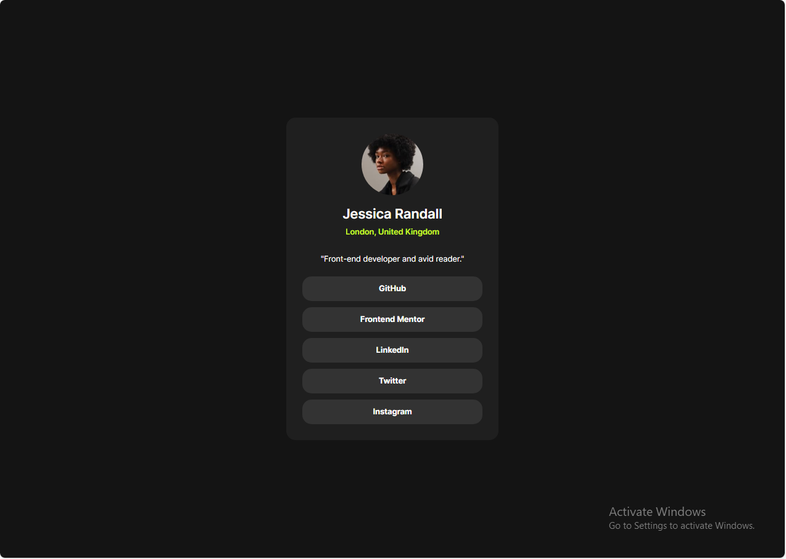

# Frontend Mentor - Social links profile solution

This is a solution to the [Social links profile challenge on Frontend Mentor](https://www.frontendmentor.io/challenges/social-links-profile-UG32l9m6dQ). Frontend Mentor challenges help you improve your coding skills by building realistic projects. 

## Table of contents

- [Overview](#overview)
  - [The challenge](#the-challenge)
  - [Screenshot](#screenshot)
  - [Links](#links)
- [My process](#my-process)
  - [Built with](#built-with)
  - [What I learned](#what-i-learned)
  - [Continued development](#continued-development)
  - [Useful resources](#useful-resources)
- [Author](#author)


## Overview

### The challenge

Users should be able to:
- View the optimal layout for the interface depending on their device's screen size.
- See hover and focus states for all interactive elements on the page.

### Screenshot



### Links

- Solution URL: [Add solution URL here](https://your-solution-url.com)
- Live Site URL: [Add live site URL here](https://your-live-site-url.com)

## My process

### Built with

- Semantic HTML5.
- CSS Custom Properties (Variables).
- Flexbox.
- Mobile-first workflow.
- Font-face integration (local fonts).
- Responsive clamp() function for typography

### What I learned

During this challenge, I practiced:
- Defining and using CSS variables for consistent theming.
- Using clamp() to create responsive font sizes.
- Styling interactive states like :hover, :focus, and :active.
- Making layout components like buttons accessible and visually appealing.

```css
.links a:hover, .links a:focus {
  color: var(--grey-700);
  background-color: var(--green);
}

```

### Continued development

In future projects, I’d like to continue improving my responsiveness techniques with CSS Grid, practice accessibility best practices like keyboard navigation, and further explore semantic HTML.

### Useful resources

- [MDN Web Docs](https://developer.mozilla.org/en-US/) - Always my go-to reference.
- [CSS Variables Guide](https://css-tricks.com/a-complete-guide-to-custom-properties/) - Helped me better understand practical use cases.
- [Clamp Generator](https://clamp.font-size.app/) - Very useful for responsive typography.

## Author

- Website - [Abdul-Rahman Nasser](https://github.com/Abdul-RahmanNasser)
- Frontend Mentor - [@Abdul-RahmanNasser](https://www.frontendmentor.io/profile/Abdul-RahmanNasser)
- Twitter - [@NasrAlstar](https://x.com/NasrAlstar)